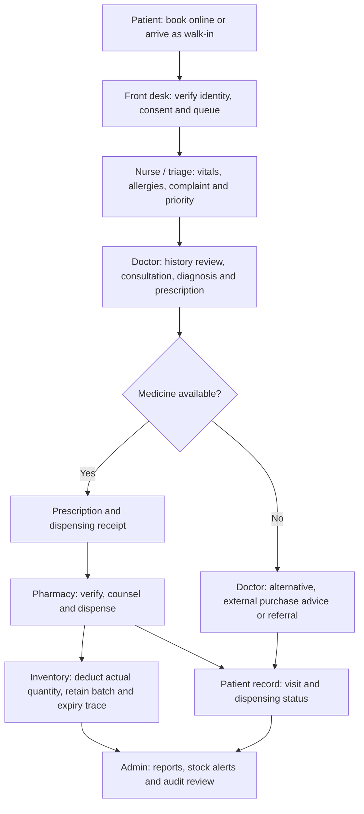

# SmartServe workflow and storyboard

## Purpose

SmartServe supports a patient from booking through consultation, prescription, pharmacy dispensing, medical-record viewing, and clinic administration. The current application is a frontend demonstration of this workflow; all clinical data shown is sample data.

## Roles and actions

| Role | Main functions | Result / handoff |
| --- | --- | --- |
| Patient | Register or sign in, book a service, choose a schedule, pin location, check queue and alerts, view own approved medical records and prescription status. | Receives a queue number; goes to the health center; can see the visit outcome and pharmacy status. |
| Front desk / queue staff | Register walk-ins, verify patient identity and consent, find/create the digital record, check in the patient, assign a queue number, update queue status, and route to the service room. | Patient is marked present and sent to triage. |
| Nurse / triage staff | Record chief complaint, temperature, blood pressure, weight, allergies, and urgency; flag priority or emergency referral. | Triage record is available to the doctor. |
| Doctor | Review patient profile, past records, allergies, and triage notes; document diagnosis, clinical notes, care plan, referral, follow-up, and prescription; check medicine availability. | Prescription is sent to the pharmacy. The patient receives a prescription/dispensing receipt. |
| Pharmacy staff | Verify patient and doctor prescription; check quantity, batch, and expiry; counsel the patient; record complete, partial, or unavailable dispensing; issue a dispensing receipt. | Medicine is given and the patient record receives the dispensing outcome. |
| Inventory staff | Receive stock, update medicine catalog, record batches/expiry, set reorder points, perform approved stock adjustments, handle returns/expired stock, and monitor low-stock alerts. | Accurate inventory is available to pharmacy and doctors. |
| Administrator | Manage users and permissions, services, schedules, clinic reports, inventory oversight, record access, audit trails, digitization of paper files, data quality, and backup/recovery policies. | Safe, monitored clinic operations and reporting. |

## Main patient-care workflow

1. **Booking or walk-in:** The patient books a service in the mobile view or arrives at the clinic. Front desk staff register a walk-in when needed.
2. **Identity, consent, and queue:** Front desk verifies the patient, confirms consent, checks for an existing record, assigns a queue number, and marks the patient present.
3. **Triage:** A nurse or trained staff member records vital signs, allergies, chief complaint, and priority. Emergency cases are routed or referred immediately.
4. **Consultation:** The doctor opens the patient’s digital history and triage record, conducts consultation, records diagnosis and notes, then prepares treatment.
5. **Medicine availability:** Before issuing a prescription, the doctor checks read-only clinic medicine stock. If stock is unavailable, the doctor can select an alternative, advise external purchase, or refer.
6. **Prescription and receipt:** The doctor sends the prescription to the pharmacy. The patient receives a prescription/dispensing receipt with medicine and quantity.
7. **Pharmacy dispensing:** Pharmacy staff verify the patient and prescription, inspect batch and expiry, then provide medication/counselling. The system records whether it was fully or partially dispensed, or unavailable.
8. **Inventory update:** Stock is reduced only by the quantity actually dispensed. Low stock, expiring medicines, and adjustments are visible to inventory staff and administrators.
9. **Patient records:** The completed visit, diagnosis, prescription, and dispensing result appear in the patient’s permitted medical-record view.
10. **Administration and reporting:** Administrators review audit events, digitized paper records, clinic operations, medicine use, stock-outs, and service reports.

## Storyboard: a single consultation and medicine pickup

| Scene | Actor and screen | Action | System outcome |
| --- | --- | --- | --- |
| 1 | Patient — Mobile app | Maria books a general consultation and receives queue number A-009. | Appointment and location are recorded in the demo. |
| 2 | Front desk — Check-in | Staff find Maria, verify her details, and mark her present. | Her queue status becomes **Waiting**. |
| 3 | Nurse — Triage | Nurse records 38.1 °C temperature, blood pressure, symptoms, and no known allergies. | A triage record is prepared for the doctor. |
| 4 | Doctor — Consultation | Doctor opens Maria’s history, documents acute respiratory infection, and recommends paracetamol. | Clinical note and prescription are created. |
| 5 | Doctor — Stock check | Doctor checks Paracetamol 500 mg stock and sees it is available. | Prescription can be sent to clinic pharmacy; doctor cannot change stock. |
| 6 | Patient — Receipt | Maria receives a prescription/dispensing receipt and proceeds to pharmacy. | Prescription status is **Ready for pickup**. |
| 7 | Pharmacy staff — Dispensing | Staff verify Maria, give 12 tablets from the valid batch, and explain the instructions. | Receipt becomes **Dispensed** and stock decreases by 12. |
| 8 | Patient — Medical records | Maria opens her record and sees the visit, diagnosis, medicine, instructions, and dispensing status. | Patient can keep track of her own approved history. |
| 9 | Admin / inventory | Staff monitor medicine balance, low-stock alert, dispensing history, and audit entry. | Clinic can plan restocking and trace actions. |

## Role handoffs

## Record digitization workflow

1. Records staff search for the patient and identify paper files that belong to them.
2. The file is scanned or manually encoded with its document type, date, source, encoder, and verification status.
3. A qualified staff member validates that the digital copy matches the paper record.
4. Administrators restrict access by role and retain an audit entry for every view, edit, download, print, or correction.
5. The original paper record is retained or disposed of only under the clinic’s approved retention policy.

## Prototype status

The interfaces now demonstrate the patient, staff/queue, doctor, pharmacy/inventory, and administrator workflow. It still requires a secure backend and operational safeguards before real public-clinic use: authentication, role permissions, encrypted storage, consent management, audit logs, backups, disaster recovery, security testing, staff training, and formal privacy/compliance review.
